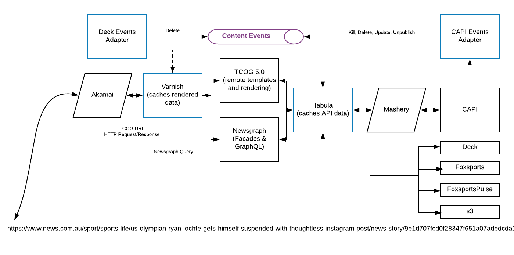

# Introduction

Welcome to DCS documentation. yeh ,,,,

* <a href="tcog.html">TCOG</a></li>
* <a href="newsgraph.html">Newsgraph</a>

## Our Logical Architecture

## CAPI API Keys

API calls to TCOG and Newsgraphg require the use of a CAPI API key. If you do not have one you should <a href="mailto:dl-newsapi-support@news.com.au">email CAPI Support</a>.

## Background Technical Material

* <a href="https://docs.google.com/presentation/d/1EzBHRskTae7MQTdYmPzXLBhRBatLYFao5LgQMCJA7y8/">Brown Bag, Building a CAPI Cache, mid 2018</a>.
* <a href="https://docs.google.com/presentation/d/1GoSl1u3WFN0aKvX4PvNaZR0NLcA9T-41It7ZGwczwrE">Lightning Talk, Varnish, mid 2018</a>.
* <a href="https://docs.google.com/presentation/d/1LlXAV65d8I30MZn8-7Ximc0_WKH3oTdZ6GtVzK_6m7Q/#slide=id.g3c20aed187_0_0">DCS Update, mid 2018</a>. DCS Logical Architecture diagram on slide 13.
* <a href="https://docs.google.com/presentation/d/1HdbndprETxyyKrYaQlxaAX1JemvSnVbXYZMbriMsJvU/#slide=id.gd9c453428_0_16">DCS Update, late 2017</a>. Slides 9, 10, 11 and 13 have architectural diagrams of TCOG issues and the DCS refactor.
* <a href="https://docs.google.com/presentation/d/1DYwi-XFIzZgWcCa72nywnMPcpkrifpoVMqx3RQj4Exs/#slide=id.p">TCOG2 Planning, early 2017</a>
* <a href="https://docs.google.com/presentation/d/1G7fFhXAlsiaw1anrMMuTWXy57fZoDBJn7XeESl5sy1A/#slide=id.p">TCOG early 2017 Wins</a> deck
* <a href="https://docs.google.com/document/d/14tHkCVd77VzI_gzhIFEs4WoxMLMqtmwLgFyM9Jp32EA/">Kubernetes Proof of Concept</a> diagram
* <a href="https://docs.google.com/presentation/d/1Lc5wIZh0TygIQMyiIrJwfsqwJd6lgz6dlY2NIPREyEA/#slide=id.p">TCOG + OPs</a> planning document (early 2017)
* <a href="https://docs.google.com/document/d/1FwR-rSDFXj04igbQfKKZ93XV0VYH4nAw-3Q2q4NkmlQ/#heading=h.fpgxrf4v1ii4">Mid 2016 TCOG Planning document</a>

## TCOG Template Owners

<a href="https://docs.google.com/document/d/1xn5e747UxeUM-q0NOknL3f1FRly7TAXJKRgaPLU6rK0/#heading=h.qtz3dgv7tn3">This document</a> lists who is responsible for which templates.