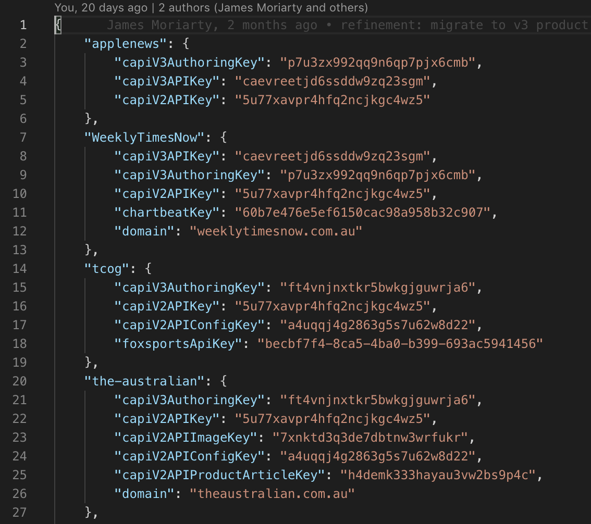
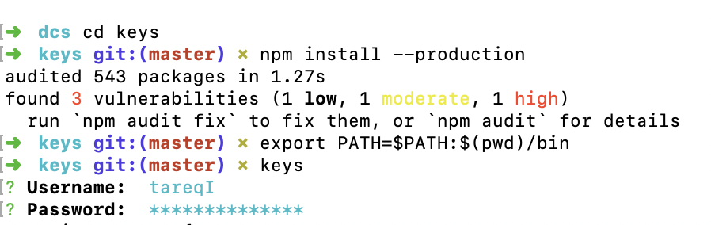

# Introduction

[TCOG](http://tcog.news.com.au/) is a transformation tier for consuming various content sources and delivering templates. In a nutshell, TCOG is responsible for fetching templates and content, combining them together and sending the end-result back to the client.


# URL Organisation

URLs are split into two types:

- 1 to 1 Mappings with an existing API
- TCOG components 

## 1 to 1 Mappings URL Structure

"1 to 1" Mappings mimick the URLs of the API they are modelled after, except they are preceded by a URI part indicating who owns the URL. Currently there are 1 to 1 Mappings to the Content and Config API.

For example `http://tcog.news.com.au/news/content/v1/?t_product=tcog` mirrors the call to `http://cdn.newsapi.com.au/content/v1/?api_key=XYZ123`

This is a foresight for when we need TCOG to sit before other APIs.

TCOG passes on every URI parameter, except those prefixed with `t_` (eg: t_product), to the downstream endpoint.

### Product Identifiers

TCOG URLs use a `t_product` URI parameter. TCOG internally keeps a configuration key-value store that is used to look up required data for the service TCOG is calling. In the context of using the Content API, `t_product=tcog` will mean that TCOG can look up the Content API and Image API keys configured for the tcog product that are required by the downstream API.

The product also specifies who should be contacted if an error occurs. Notifications are conveyed via [Opsgenie](http://www.opsgenie.com/).


### TCOG Components

Components live under the /component/ namespace in the URI. They also require a `t_product` identifier.

Components are customised endpoints that solve specific problems not met by downstream APIs.

### URI Parameters

TCOG uses any URI parameter that begins with the `t_`, `tc_` and `td_` prefixes. These parameters are removed from the downstream request to the API TCOG fronts. Any other URI parameter will be passed along.

-	`t_` - top level tcog options
-	`tc_` - signifies anything to do with a config
-	`td_` signifies anything to do with display overrides

TCOG has a variety of URI parameters that operate to produce various effects suchs as:

-	toggling on specific parts of templates (whether to show a title, a standfirst, etc.)
-	indicating which template to use (the `t_template` parameter)
-	which css classes or pieces of text to use (all text is sanitized before appearing in a template)

Unless overridden by `t_template` the default template is usually 'extended'.

| Parameter      | Example          | Required 
| -------------- | ---------------- | -------- 
| `t_product`    | `DailyTelegraph` | Yes
| `t_template`   | `s3/something`   | Yes  
| `t_output`     | `json`           | No
| `tc_something` | TBA              | TBA
| `td_timestamp` | TBA              | TBA

<aside class="notice">NOTE: <code>t_product</code> parameters are case sensitive. <code>DailyTelegraph</code> and <code>dailytelgraph</code> will be treated differently.</aside>


# Create a new stack

Below is an explanation of how you can create & setup a stack of all the DCS services.

## Create config files

There are a total of 3 config files that needs to be created. The first one is in the `devops` folder
and the remaining two are in the `tcog` folder.

Inside the tcog folder, under conf you will need to add a config file to the `envs` folder and the 
`products` folder. Here's an example of what each file could look like:

#### /tcog/conf/envs/duat.json


#### /tcog/conf/products/duat2.json



Below is an example of what the config file in the devops folder can look like:

#### /devops/env/duat-uat


You can basically copy-paste the information from the other config files and add/remove the 
relevant information. For example, while creating the p13n stack, the data was copied from 
the duat config files since it was running on uat.

## Build branch


## Push Docker images


## Authenticate with keys




## Run command to build stack in AWS


where `{Name}` would be the root stack name, `{Environment}` would be the cloud formation template to use from the devops/env folder and {Tag} is the sha
generated when you push to Docker.

NOTE: The command in the screenshot is only for deploying to UAT.

## Check cloud formation for progress and output


## Make DNS changes (if needed)

## Push branch to OPS Stash repository

## Build branch

## Create new release

## Deploy to DIGUAT Cold

## Test the new stack

## Deploy to DIGUAT DNS 


# Git practices 

The below is an overview of how we use git (Stash) to take on new work and share it with the team.

Make a Pull Request for everything - features, docs, etc. - except incrementing a TCOG version in package.json. That's done on master.

At times we have broken this rule to accomodate an emergency. We generally regret doing so.

Although at times we may deploy feature branchs to non-prod TCOG stacks to support the business, the master branch is what we use for production.

## Naming your Branch

Use a branch prefix that maps to the purpose of your branch. 

`feature/add-the-livefyre-API`
`bugfix/replace-brightcove-with-video-integrator`
`tweak/uat-uses-c3s`
`new-stack/tcog-prd3`

We don't have strict rules about what makes sense as a prefix, sometimes new ones emerge, but the four above should get you a fair way.

## Feature Branches and Rebasing

We use a 'feature branch' strategy for git. It means you can work on a particular branch in isolation however you like, using rebases to keep in sync with changes on the master branch. 

Finally, when you are happy with your work, you should run a final interactive rebase (see below), which allows all of your changes to appear as one git commit change with a meaningful message for the git log. Only bringing one commit into master keeps it simple for us to track changes.

An example git log:

```
commit e0d5ec37f1170b787bbbcd7b4e4c77435da6f816
Author: Nicholas Faiz <nicholasf@mngl1002224.news.newslimited.local>
Date:   Tue Feb 28 09:50:24 2017 +1100

    v4.18.0
    
    * Remove counting stream from logs and health check
    * Worker lib no longer requires analytics.
    * Remove logstash from the sqs listener
    * Remove analytics from, invalidator
    * Replace logging in agent from logstash analytics to bunyan logger. Only log errors
    * Refactor analytics out of deprecate-params
    * Remove analytics/bench from template_loader
    * Removed analytics
    * Remove opsgenie
    * Remove analytics redis from config
    * Redis connection timeout set to 20 seconds, tcp-keepalive 300 (as the default value for 3.2.4)

```

The above was a large codebase refactor, so it touched on many points. Shorter descriptions of work are okay too.

## Example flow of a Feature Branch

`git checkout -b feature/vidora-integration`

You make any number of commits on your branch. A few "WIP" commit messages, etc..

At some stage you want to bring in changes from master.

Run `git log` and count `n` the number of git commits you've made.

### Squashing up via rebase

Squashing up means you will combine a number of commits into one commit. You use this to bring together all your commit messages.

Let's say `n`=5.

`git rebase -i HEAD~5` 

You will see a list of git commits. For each one except the very top specify `s`.

For example:

```
pick c483b286 tweak: update video documentation for capi v2
s 40a1b7d0 The Vidora prototype.
```

Where I am 'squashing up" from 40a1b7d0 into c483b286. Another way of saying it is ensure that the top line is left with pick but the other lines begin with an s.

Save this and then decide how to craft your log messages into a single meaningful one.

### Rebasing against master

Then run `git rebase master`.

If you open the git log and look, you will see your commit is at the top of the tree, with the latest changes from master beneath it.

If you have run into conflicts you will need to resolve them then `git rebase --continue`. At any stage you can `git rebase --abort` if you are unhappy with how a conflict was resolved.

By following this process you can continually work on your branch and hone it, rebasing against master to get its lastest work.

### Ready for a PR

When you are ready to submit a PR run a `git push` and follow the instructions Stash will give you.

```
♪  tcog git:(docs/how-to-stash) ✗ git push
fatal: The current branch docs/how-to-stash has no upstream branch.
To push the current branch and set the remote as upstream, use

    git push --set-upstream origin docs/how-to-stash
```

After running `git push --set-upstream origin docs/how-to-stash` Stash responds with a URL that will let me create a PR.

```
remote: Create pull request for docs/how-to-stash:
remote:   http://stash.news.com.au/projects/TCOG/repos/tcog/compare/commits?sourceBranch=refs/heads/docs/how-to-stash 
```

## Pull Requests

Pull Requests are a well documented convention in the programming world these days. Some internal conventions we use are:

* be time effective, if the reviewer suggests several small tweaks but is otherwise happy with the code, then it's good to merge as soon as the small tweaks are done (no need for another round of formal review).
* the owner fo the PR is responsible for keeping the branch up to date (rebased) against master (so it's also good for the reviewer to be efficient about reacting to new PRs).

## General Dos and Donts

* Do use PRs as a place to discuss best practices and ideas. PRs mean at least two devs have agreed with new code and open up a space of conversation.
* Don't form new feature branchs of other feature branches. Sometimes this creates a chain of dependencies that haven't been agreed to by another team member. It's always best to branch off master.


# Akamai

All users should be using the Akamai endpoint of tcog. An Akamai endpoint is denoted by `a.` in the hostname eg `a.tcog.news.com.au`. The only time the origin host is used is between Akamai and tcog. Akamai generally handles two types of logic - caching and proxying behaviours. 

ESI processing of fragments is turned off by defualt. It has to be explicitly opted into by appending the `esi=true` param.

eg:

```
origin : http://tcog.news.com.au/component/article/dailytelegraph/desktop/newslocal/inner-west/westconnex-richard-moras-fed-up-with-workers-wrongly-identifying-his-st-peters-house-to-be-demolished/news-story/3e92c0fd276f5108fd353694e42f0585?t_product=DailyTelegraph&t_template=s3/chronicle-templaterouter/index
akamai : http://a.tcog.news.com.au/component/article/dailytelegraph/desktop/newslocal/inner-west/westconnex-richard-moras-fed-up-with-workers-wrongly-identifying-his-st-peters-house-to-be-demolished/news-story/3e92c0fd276f5108fd353694e42f0585?t_product=DailyTelegraph&t_template=s3/chronicle-templaterouter/index
esi    : http://a.tcog.news.com.au/component/article/dailytelegraph/desktop/newslocal/inner-west/westconnex-richard-moras-fed-up-with-workers-wrongly-identifying-his-st-peters-house-to-be-demolished/news-story/3e92c0fd276f5108fd353694e42f0585?t_product=DailyTelegraph&t_template=s3/chronicle-templaterouter/index&esi=true
```

### Integrations ( routing )

Sites can integrate with tcog in one of two ways, as above with tcog fragments or via an origin mapping. An origin mapping is where a site offloads the responsibility for processing a request to an external service.

Within our network we have origin mappings for metros, regionals and nationals which direct traffic for articles and galleries to tcog.

For a site to integrate in this way the following information is required by tcog in-order for tcog to permit access.

- **x-tcog-template** : the remote template to user
- **x-tcog-product** : the tcog product name

<aside class="notice">These request headers are the equivalent of the <code>t_product</code> & <code>t_template</code> query parameters.</aside>


In addition to this, the tcog host is required. This may be different depending upon the environment you are integrating with and an origin base path. The origin base path relates to the default path to the origin host eg: "/component/article".

Rules are the applied to determine when this routing should occur. For example

- /news-story/* : if the requests if of type article
- /image-gallery/* : if the requests if of type gallery
- /story-*-* : legacy article urls
- /(photos|gallery)-*-* : legacy gallery urls

**Examples**

```
- http://www.news.com.au/world/north-america/trump-to-oreilly-i-dont-know-if-obama-will-admit-this/news-story/a5d640220809d9866309d3054c5cfacf
- http://www.dailytelegraph.com.au/entertainment/inside-starstudded-super-bowl-2017/image-gallery/8ffdcd0e34986a70939649bc13d7eea5
- https://www.couriermail.com.au/business/companies/fortescue-metals-restructures-rosters-for-pilbara-mine-workers/news-story/fb59d53e19b0abc3152716cc86acfa32
```
Akamai will forward request in all cases to tcog as follows.

`tcog.news.com.au/component/article/<request-path>?<request-querystring>`

<aside class="notice">It's worth noting that image gallery uses the same endpoint as article. For example <code>t_product</code> & <code>t_template</code> query parameters.</aside>


### Debugging

Akamai provides a debug console for testing urls which are Akamai enabled and may also contain nested fragments.

Often you may need to help teams debug why a tcog url is not working when it is ESI'd into a page.

1. Visit https://fed3.news.net.au/adfs/ls/idpinitiatedsignon.aspx
2. Select "Akamai Luna Portal" from drop down
3. Visit https://newscomau.luna-sp.com/portal/esid_2.jsp

The debug portal has the following options

- **URL to Debug** : the url you need to test ( www.news.com.au/... or a.tcog.news.com.au )

Most environments are configured to work with Akamai.

- **Client Request Headers** : additional headers needed to access the page

The following additional headers are required in-order to correctly debug pages on our network.

```
ndmesidebug:654321
Cookie: nk=anything; n_regis=anything; n_rme=anything; open_token=anonymous; sr=true
```

ndmesidebug is need to bypass IP restrictions that some urls may have in place and the Cookie header is needed to force a paywall bypass.

ESI Developer Guide : https://www.akamai.com/us/en/multimedia/documents/technical-publication/akamai-esi-developers-guide-technical-publication.pdf

#### Debug Headers Extension

This extension makes it possible to inpect information Akamai knows about a request it received such as how it has been cached, for how long and which ghost server processed it.

See video/akamai-headers.mp4 for more detail.

https://chrome.google.com/webstore/detail/akamai-debug-headers/lcfphdldglgaodelggpckakfficpeefj?hl=en

#### Debugging config changes

An Akamai config can be deployed to two networks. A staging network where you can conduct testing prior to a production deployment and the production network.

Depending upon the change made you may be able to verify using the Debug Headers Extension alone. Should this not be possible you may have to resort to using curl.

In either scenario you will need to ensure that the host you are attempting to connect to is correctly routed via the staging network.

```
curl -c cookiejar -L --resolve <host>:<staging-network-ip> <url-to-test>
```
> testing via curl

```
curl -c cookiejar -L --resolve a.tcog.news.com.au:80:23.50.63.24 http://a.tcog.news.com.au/healthcheck\?t_product\=newscomau
curl -c cookiejar -L --resolve www.news.com.au:80:23.50.63.24 http://www.news.com.au/world/north-america/donald-trump-to-order-temporary-ban-refugees/news-story/9423d195c14da764324f16929281f9a1
```
> curl examples

#### Advanced ( experimental )

An advanced debug capability is available using a local dockerised version of Akamais testing server ETS.

See : http://stash.news.com.au/projects/TCOG/repos/akamai-ets/browse

### Testing Properties on the Akamai Staging Network

For every domain name that Akamai hosts - news.com.au, a.tcog.news.com.au, newsuat.com.au, a.uat.tcog.news.com.au etc. - there is a staging and production network. The staging network is available to test a configuration before it is released to production. Akamai uses "properties" to represent the configuration of a domain.

Do not be confused by the fact that newsuat.com.au and a.uat.tcog.news.com.au are hosted in the same Akamai networks as news.com.au and a.tcog.news.com.au. They are just domain names to Akamai. Whether we treat them as preproduction or production sites once they are finally hosted the Akamai production network is incidental to Akamai.

<aside class="notice">Below is an example of the different domain names that exist in the Akamai network. Bear in mind, this is NOT an exhaustive list.</aside>


### Testing Proxy Logic in Akamai

#### Testing in staging as though it were in production

1) Discover the IP address of the staging network.

In the example below, all you have to remember is to ping a.tcog.news.com.au then to attach `-staging` to the Akamai edge networking name.

```
♪  ~  ping a.tcog.news.com.au
PING e3774.b.akamaiedge.net (23.40.72.153): 56 data bytes
♪  ~  ping e3774.b.akamaiedge-staging.net
PING e3774.b.akamaiedge-staging.net (23.47.83.55): 56 data bytes
...

Now, you can map any call to a domain name to the the Akamai staging server itself.

#### Testing via curl

```
curl -c cookiejar -L --resolve a.tcog.news.com.au:443:23.47.83.55 http://a.tcog.news.com.au/healthcheck\?t_product\=TownsvilleBulletin
{"status":"ok","version":"5.0.0","nodeVersion":"8.12.0","environment":"dprod-dcs4"}%                                                  
```

In this circumstance, we verified that the Akamai property for a.tcog.news.com.au proxies into dprod-dcs4 for the TownsvilleBulletin Product.

# Eventing